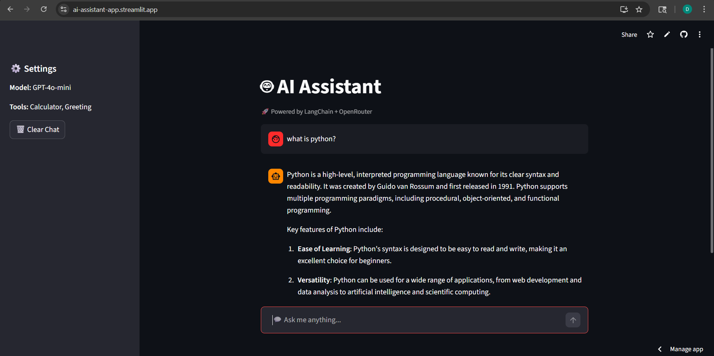
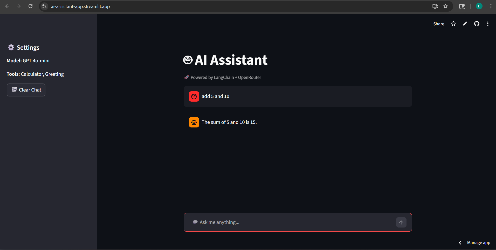

# 🤖 AI Assistant (Streamlit + LangChain)

[]()
[]()
[]()
[]()

---

## 🌐 Live Demo

👉 https://ai-assistant-app.streamlit.app

---

## 🖼️ Screenshots

### 💬 Chat UI


### ⚙️ Tool Execution


---

## 🧠 Features

* 🤖 AI-powered assistant using LangChain agents
* 🛠️ Tool integration (Calculator + Greeting)
* 💬 Real-time streaming responses
* 🧠 Chat memory using Streamlit session state
* 🌐 Deployed on Streamlit Cloud
* 🔐 Secure API key handling

---

## 🏗️ Tech Stack

* **Frontend:** Streamlit
* **Backend:** Python
* **AI Framework:** LangChain + LangGraph
* **Model API:** OpenRouter (GPT-4o-mini)

---

## ⚙️ Installation (Run Locally)

```bash
# Clone repo
git clone https://github.com/YOUR_USERNAME/ai-assistant-streamlit.git
cd ai-assistant-streamlit

# Create virtual environment
python -m venv .venv
.venv\Scripts\activate

# Install dependencies
pip install -r requirements.txt

# Add API key
echo OPENROUTER_API_KEY=your_key_here > .env

# Run app
streamlit run app.py
```

---

## 🔑 Environment Variables

Create a `.env` file:

```
OPENROUTER_API_KEY=your_api_key
```

---

## 📂 Project Structure

```
├── app.py
├── requirements.txt
├── README.md
├── .gitignore
└── screenshots/
```

---

## 🚀 Deployment

This app is deployed using Streamlit Cloud:

1. Push code to GitHub
2. Connect repo to Streamlit
3. Add secrets (`OPENROUTER_API_KEY`)
4. Deploy

---

## 🙌 Acknowledgements

* LangChain
* Streamlit
* OpenRouter

---

## 📜 License

MIT License
